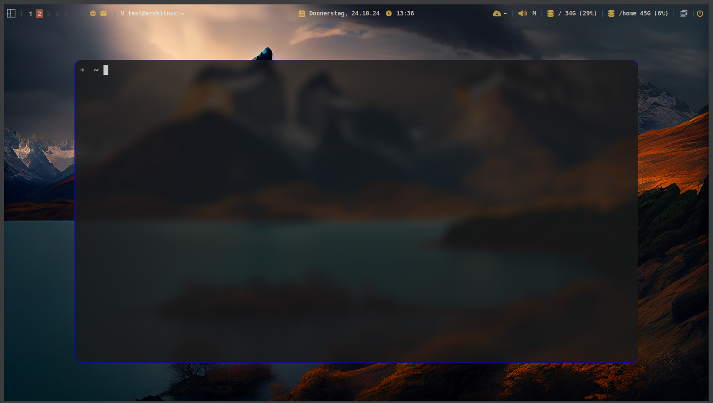

# my-dotfiles

## Required Software
- alacritty
- bash-completion
- betterlockscreen
- btop
- dmenu
- dunst
- eza
- fastfetch
- feh
- neovim
- picom
- qtile
- stow
- zsh
- zsh-completions

## Screenshot
